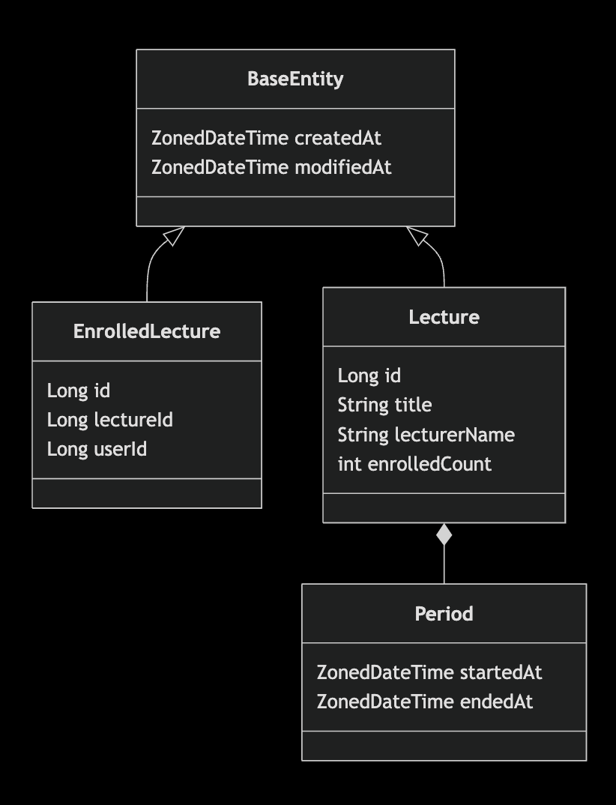

# 항해플러스 백엔드 7기 - 2주차

## 요구사항

### API 명세

- 특강 신청 API
  - `userId`로 특강에 선착순으로 신청
  - 동일한 사용자가 동일한 강의에 대해서 한 번의 수강 신청만 성공
  - 특강은 선착순 30명만 신청가능하며, 선착순 30명이 넘으면 신청 실패
- 특강 신청 가능 목록 API
  - 날짜별로 신청 가능한 특강 목록 조회
- 특강 신청 완료 목록 API
  - 특정 `userId`로 신청 완료(성공)한 특강 목록 조회
  - 항목은 특강 ID, 특강명, 강연자 정보

### Step03

- 설계에 대한 ERD 작성 및 설계 이유를 README 작성
- 선착순 30명 이후의 신청자의 경우 실패하도록 개선
- 동시에 같은 특강에 **40명**이 신청했을 때, 30명만 성공하는 것을 검증하는 통합 테스트 작성

### Step04

- 같은 사용자가 동일한 특강에 대해 신청 실패하도록 개선
- 같은 사용자가 동일한 특강을 **5번** 신청했을 때, 1번만 성공하는 것을 검증하는 통합 테스트 작성

### 요구사항 분석

- 용어 정리
  - 특강: `Lecture`
  - 신청한 특강: `EnrolledLecture`
- 특강의 정원(30명)은 추후 바뀔 가능성이 있지만 현재는 30명으로 고정되어 있음.
  - '30'을 상수로 관리하기 보다는 `LectureCapacityProvider` 객체에서 제공
- 특강이라는 도메인 특성상 한번에 대규모의 트래픽이 예상되므로 `Lecture`에서 `currentEnrolledCount` 상태로 현재 신청 인원 수를 관리한다.
  - `EnrolledLecture`에서 강의 ID에 대한 `count`를 할 수 있지만 성능 이슈가 있음.
  - 예기치 않은 오류 발생 시 `EnrolledLecture`와의 데이터 정합성 관리가 필요
- 사용자가 신청 가능한 특강 목록 조회시 '모집기간'으로 필터링 하며, 정원이 꽉 찼거나, 이미 신청한 특강인 경우 '신청 가능' 상태를 'N'으로 세팅해 반환한다.
- 사용자는 `userId`로 주어지며 사용자 관련해서는 생각하지 않는다.(요청에 대해 무조건 유효하다.)

### Step03 - ERD 작성

#### ERD



##### 테이블 

```mysql
create table lecture
(
    id                          bigint unsigned auto_increment,
    title                       varchar(100)      not null comment '강의명',
    lecturer_name               varchar(30)       not null comment '강사명',
    enrolled_count              SMALLINT unsigned not null default 0 comment '수강신청인원',
    application_start_date_time timestamp(0)      not null comment '수강신청시작일시',
    application_end_date_time   timestamp(0)      not null comment '수강신청마감일시',
    created_at                  timestamp(0)      not null default current_timestamp(0) comment '생성일시',
    modified_at                 timestamp(0)      not null default current_timestamp(0) comment '수정일시',
    deleted_at                  timestamp(0) comment '삭제일시',
    primary key (id)
);

create table enrolled_lecture
(
    id          bigint unsigned auto_increment,
    lecture_id  bigint unsigned not null comment '강의 ID',
    user_id     bigint unsigned not null comment '수강신청자 ID',
    enrolled_at timestamp(0)    not null default current_timestamp(0) comment '수강신청일시',
    modified_at timestamp(0)    not null default current_timestamp(0) comment '수강신청일시',
    deleted_at  timestamp(0) comment '삭제일시',
    primary key (id)
);
```

#### 과제 Key Point

이번 과제의 기능적 요구 사항은 '강의의 정원인 30명을 초과하지 말 것'(이하 요구사항 A), '이미 신청한 강의에 중복 신청 시 실패할 것'(이하 요구사항 B)이라고 생각합니다.  
그중 요구사항 B는 요구사항 A가 만족한 뒤에야 기능 개발을 할 수 있다고 생각했습니다. 왜냐하면 요구사항 B의 전제는 '강의에 신청이 되어 있을 것'이기 때문입니다.  
그래서 이번 과제에서 가장 중요한 부분은 '하나의 강의에 신청한 인원수'(이하 신청 수)를 어떻게 관리하는가라고 생각했습니다.  

결론적으로 이야기하자면 신청 수를 관리하기 위해서 비관적 락을 사용하기로 결정했습니다.

#### 비관적 락을 사용하는 이유

DB를 이용해 '여러 애플리케이션 서버에서 사용하는 데이터의 정합성'을 보장하는 방법은 `DB Lock`이라고 생각했습니다.
낙관적 락(Optimistic Lock)과 비관적 락(Pessimistic Lock) 중 현재 도메인에 적절한 락은 비관적 락이라고 생각해서 비관적 락을 사용하기로 했습니다.  
그 이유는 특강 신청 시 최소 50여 명의 인원이 1~2초 내에 동시에 요청을 보내며, 50명이 각각 한 번의 요청을 보내는 것이 아니라 소위 말하는 마우스 광클로 여러 번의 요청을 보낼 수 있다고 생각했습니다. 
따라서 데이터 정합성이 맞을 때까지 계속적으로 DB에 요청을 보내는 낙관적 락은 비관적 락보다 서버에 큰 부하를 줄 수 있음은 물론이고 성능도 더 안 좋을 수 있다고 판단했기 때문입니다.

그리고 현재 신청 수를 증가시키는 작업이기 때문에 동시에 읽기 자체를 막기 위해 공유 잠금이 아닌 배타적 잠금을 사용하기로 결정했습니다.


#### 비관적 락을 사용하기 적절한 설계

```
1. `LECTURE` 테이블에 신청 수 컬럼을 추가하는 방법
  - 장점
    - 신청 수 검증의 책임을 `Lecture` 객체에게 줄 수 있음
    - 낙관적 락 사용 가능
  - 단점
    - `LECTURE` 테이블이 오염됨
    - `ENROLLED_LECTURE` 테이블과의 정합성을 신경써야 함
2. `ENROLLED_LECTURE` 테이블에서 `COUNT` 쿼리로 조회하는 방법
   - 장점
     - 실제 데이터를 기반으로 작동하므로 항상 정확함
     - 요구사항 변경에 유리(확장성)
   - 단점
     - `COUNT` 쿼리 호출: SQL 조건절(lecture_id = :lectureId)에 인덱스가 있다면 해당하는 모든 ROW에 잠금이 걸리고, 인덱스가 없다면 테이블 전체에 잠금이 걸림
       - 잠금 범위를 최소화하기 위해 인덱스를 추가 한다면 변경(쓰기/삭제)이 잦은 테이블의 특성상 전체적인 성능하락이 예상
        - 멘토링) 인덱스 하나로는 큰 성능 문제는 발생하지 않을 것
     - 낙관적 락 사용 불가능
3. `LECTURE_ENROLLED_COUNT` 테이블을 추가로 두는 방법(1번 방법과 2번 방법의 중간)
   - 장점
     - 요구사항 변경에 유리(확장성)
     - 별도의 인덱스가 필요하지 않음
   - 단점
     - `ENROLLED_LECTURE` 테이블과의 정합성을 신경써야 함
     - 객체, 테이블이 추가됨에 따라 유지보수 포인트가 늘어남
     - 낙관적 락 사용 불가능
```

저는 1번 방법(`LECTURE` 테이블에 신청 수 컬럼을 추가하는 방법)을 사용하기로 결정했습니다. 
그 이유는 과제 요구사항을 분석하는 과정에서 딱 과제에서 명시한 요구사항에만 집중하기로 결정했기 때문입니다.  
따라서 `LECTURE` 테이블이 신청 수 컬럼에 의해 오염되었지만 추가적인 오염은 발생하지 않는다고 가정했습니다.
추가로, 1번 방법을 통해서 '도메인 객체에게 시키는' 연습을 할 수 있다는 장점이 있다고 생각했습니다.
