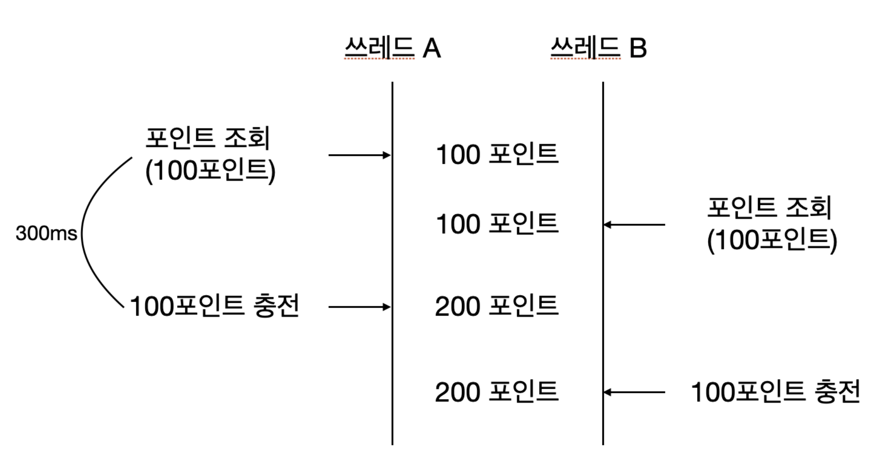

# 항해플러스 백엔드 7기 - 1주차

## 요구사항

### 기본

- `/point` 패키지 (디렉토리) 내에 `PointService` 기본 기능 작성
- `/database` 패키지의 구현체는 수정하지 않고, 이를 활용해 기능을 구현
- 포인트 조회, 포인트 충전/사용 내역 조회, 포인트 충전, 포인트 사용 기능 구현
  - 포인트 충전/사용 요청 포인트는 무조건 **양수**여야 함.
- 각 기능에 대한 단위 테스트 작성

### Step01

- [ ] 포인트 충전, 사용에 대한 정책 추가 (잔고 부족, 최대 잔고 등)
  - 최대 보유 포인트는 `100_000_000L`
  - 한번에 사용할 수 있는 최대 사용 포인트는 `100_000L`
- [ ] 동시에 여러 요청이 들어오더라도 순서대로 (혹은 한번에 하나의 요청씩만) 제어될 수 있도록 리팩토링
  - 순서 예시
    - 최초 3000: 충전 1000 + 충전 1000 + 충전 1000 => 6000
    - 최초 3000: 사용 1000 + 사용 1000 + 사용 1000 => 0
    - 최초 1000: 충전 1000 + 사용 2000 => 0
    - 최초 1000: 사용 2000 + 충전 1000 => 실패
  - 충전/사용 내역은 순차적으로 처리되지 않아도 상관 없음
- [ ] 동시성 제어에 대한 통합 테스트 작성

### Step02

- [ ] `README.md` 파일에 동시성 제어 방식에 대한 분석 및 보고서 작성
  - 보고서 소스
    - 자바 동기화 기법
      - synchronized
      - java.util.concurrent
        - atomic/
        - lock/
          - ReentrantLock
          - ReadWriteLock
          - ReentrantReadWriteLock
          - StampedLock
        - Concurrent Collection 시리즈
        - BlockingQueue
        - Semaphore
      - volatile
    - DB 동기화 기법
      - 낙관적 락
      - 비관적 락
    - 그 외
      - Redis

## 동시성 제어 방식에 대한 분석 및 보고서

### 문제 상황

포인트 충전 및 사용시 로직과 동작을 완료하는데 걸리는 시간은 아래와 같다.
1. 사용자의 포인트 조회(200ms)
2. 충전/사용 후 포인트를 계산하여 업데이트(300ms)
3. 충전/사용 내역 저장(300ms)

1번과 2번 사이에 쓰레드의 스위칭이 발생되면 올바르지 않은 결과를 초래한다.

동시성을 해결한다고 해도 **요청 순서대로 처리**해야하는 문제가 남아있다.

1. 쓰레드 A가 락을 획득한다.
2. 쓰레드 B가 락을 획득하지 못하고 대기 상태로 들어간다.
3. 쓰레드 C가 락을 획득하지 못하고 대기 상태로 들어간다.
4. 쓰레드 A의 작업이 완료되어 락을 해제한다.

이 때, 쓰레드 B부터 시작하는 것을 보장해야 요청 순서대로 처리한다고 할 수 있다.

### 용어 정리
* Synchronization
  * 여러 쓰레드 간의 작업 순서를 조율해 데이터의 일관성을 유지하는 것.
  * Mutex, Semaphore ...
* Mutual Exclusion(상호 배제, Mutex)
  * 한 번에 한 쓰레드만이 공유 자원에 접근할 수 있도록 하는 것.
* Visibility
  * 한 쓰레드가 변경한 값을 다른 쓰레드에서 즉시 볼 수 있도록 하는 것.

### 자바에서 제공하는 동시성 제어 방법

자바에서 제공하는 대표적인 동시성 제어 방법들은 아래와 같다.
* `volatile`: Visibility 보장 / Synchronization, Mutex 보장 X
  * 변수의 값을 항상 최신의 값으로 읽어야 하는 경우 사용
  * 변수의 값을 CPU 캐시가 아닌 메인 메모리에서 Read/Write
  * **여러 쓰레드가 동시에 쓰기 작업을 할 때는 원자성을 보장하지 않음**
* `synchronized`: Mutex, Visibility 보장 / Synchronization 보장 X
  * 메서드 선언부 또는 메서드 내부에 `synchronized` 블록으로 데이터 안전성 보장
  * Object의 Monitor를 통해 lock 획득
    * 인스턴스 메서드: 해당 객체의 Monitor
    * static 메서드: 해당 클래스의 Monitor
  * 재진입 가능
* Synchronized Collection: Mutex, Visibility 보장 / Synchronization 보장 X
  * `Vector`, `HashTable`, `Collections.synchronizedXXX()`
  * 해당하는 컬렉션과 동일한 메서드를 제공하지만 내부적으로 `synchronized` 사용
  * `iterator`는 동기화하지 않음
* `java.util.concurrent`
  * `atomic/`: 원자성(Atomicity) 보장
    * 동기화 없이 안전하게 값을 변경할 때 사용
  * `locks/`: Mutex, Visibility 보장 / 공정성 제공 여부에 따라 Synchronization 보장하기도 함
    * `syncronized`와 유사하지만 더 세부적인 제어가 가능
    * 락의 획득/해제를 명시적으로 관리
    * `ReentrantLock`, `ReentrantReadWriteLock`
      * 공정성(락을 요청한 순서대로 락을 획득) 제공
  * Concurrent Collection
  * `BlockingQueue`: Synchronization, Mutex, Visibility 보장
    * 큐가 비어있으면 소비자는 대기, 큐가 가득 차면 생산자는 대기
    * 우선순위 기반의 `PriorityBlockingQueue`도 있음
  * `Semaphore`: Mutex, Visibility 보장 / 공정성 여부에 따라 Synchronization 보장하기도 함
    * 동시에 접근 가능한 쓰레드 수 제한
    * 공정성 제공

### 동시성 제어 방식 선택

- `Synchronization`을 보장해야 함.
  - `ReentrantLock`
  - `ReentrantReadWriteLock`
    - 읽기의 비율이 높은 경우에 유리하므로 우리 상황에 해당되지 않음
  - `BlockingQueue`
    - queue에 적재되는 시점과 실제 기능이 실행되는 시점이 다름
    - 기능이 동작하다가 실패했을 경우의 처리가 필요함
  - `Semaphore`
    - 동시에 접근 가능한 쓰레드 수 제한이 필요하지 않음
- 한 유저에 대해서만 동시성 문제가 발생하기 때문에 유저별로 별도의 Lock을 사용하는 것이 적절함
  - 유저 ID를 key로 하는 `ConcurrentHashMap`을 사용하여 유저별 Lock을 관리
